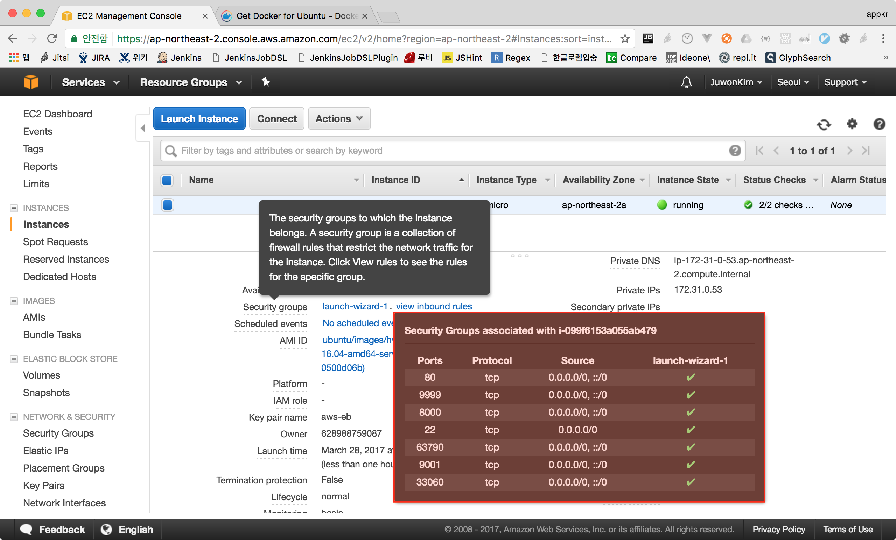
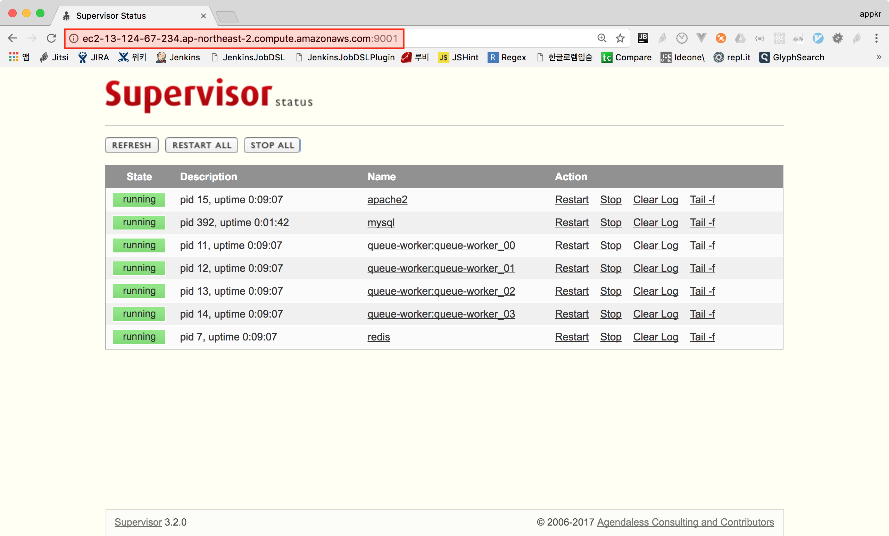
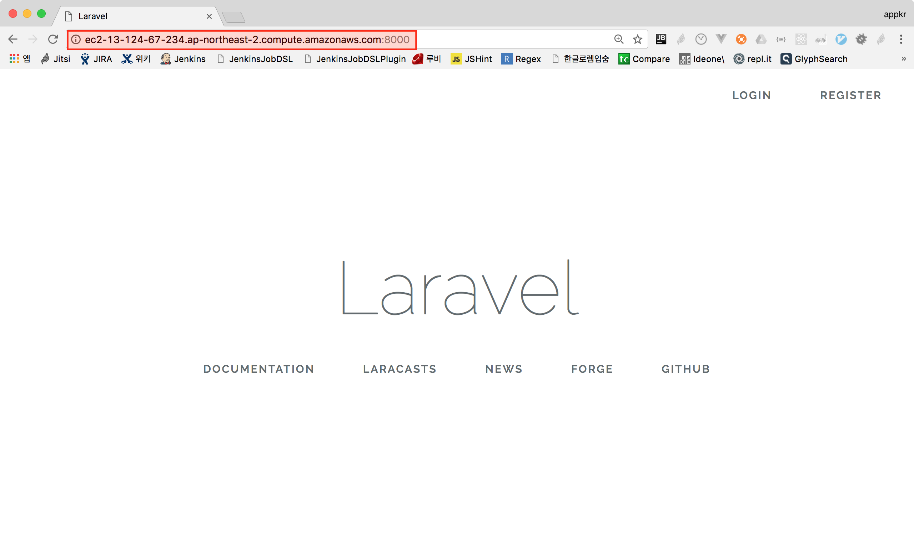
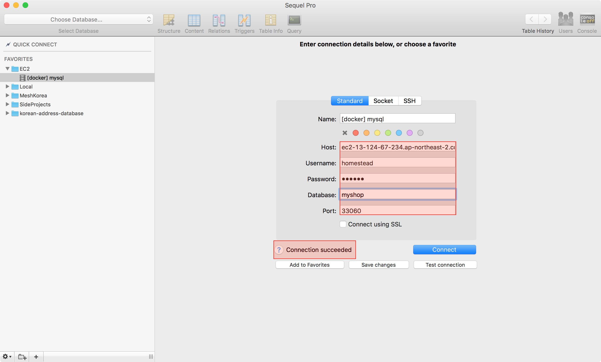
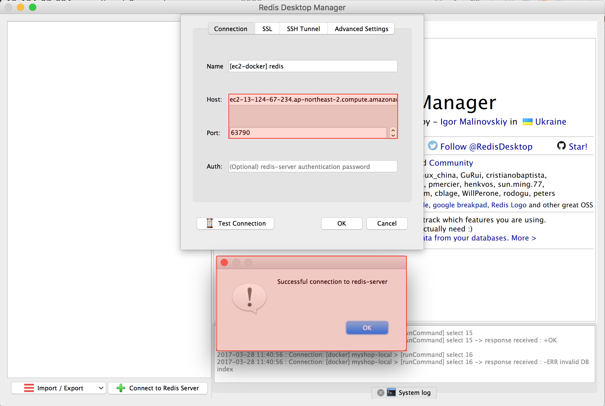

# Ubuntu 머신에서 도커 개발 환경 사용하기

## 1. 도커 설치

PPA(Personal Package Archive)를 사용하기 위해 유틸리티를 설치합니다.

```bash
ubuntu@server:~$ sudo apt-get install \
    apt-transport-https \
    ca-certificates \
    curl \
    software-properties-common
```

도커 공식 GPG 키를 등록합니다.

```bash
ubuntu@server:~$ curl -fsSL https://download.docker.com/linux/ubuntu/gpg | sudo apt-key add -
ubuntu@server:~$ sudo apt-key fingerprint 0EBFCD88
```

Stable 저장소를 등록합니다

```bash
ubuntu@server:~$ sudo add-apt-repository \
   "deb [arch=amd64] https://download.docker.com/linux/ubuntu \
   $(lsb_release -cs) \
   stable"
```

도커를 설치하고, 현재 셸 사용자를 `docker` 그룹에 추가합니다.

```bash
ubuntu@server:~$ sudo apt-get update
ubuntu@server:~$ sudo apt-get install docker-ce
ubuntu@server:~$ apt-cache madison docker-ce
ubuntu@server:~$ docker --version
# Docker version 17.03.0-ce, build 3a232c8
ubuntu@server:~$ sudo service docker status
# ● docker.service - Docker Application Container Engine
#   Loaded: loaded (/lib/systemd/system/docker.service; enabled; vendor preset: enabled)
#   Active: active (running) since Tue 2017-03-28 01:47:58 UTC; 21min ago
ubuntu@server:~$ sudo gpasswd -a ${USER} docker
```

## 2. 개발용 도커 이미지 구동

개발용으로 만든 도커 이미지를 받아 도커가 잘 작동하는 지 확인하기 위한 과정입니다. 

### 2.1. Ubuntu 인스턴스의 방화벽 설정

`8000`, `9001`, `3306`, `6379` 포트를 열었습니다.
 


### 2.2. 예제 프로젝트 설치

프로젝트를 다운로드 받아, 컴포저 패키지를 설치하기 위해 PHP를 설치합니다.

```bash
ubuntu@server:~$ sudo apt install php php-mbstring php-xml php-zip
ubuntu@server:~$ php --version
# PHP 7.0.15-0ubuntu0.16.04.4 (cli) ( NTS )
# Copyright (c) 1997-2017 The PHP Group
# Zend Engine v3.0.0, Copyright (c) 1998-2017 Zend Technologies
#    with Zend OPcache v7.0.15-0ubuntu0.16.04.4, Copyright (c) 1999-2017, by Zend Technologies
```

컴포저를 설치합니다.

```bash
ubuntu@server:~$ curl -sS https://getcomposer.org/installer | php
ubuntu@server:~$ sudo mv composer.phar /usr/local/bin/composer
ubuntu@server:~$ composer --version
# Composer version 1.4.1 2017-03-10 09:29:45
```

예제 프로젝트를 복제하고, 초기화합니다.

```bash
ubuntu@server:~$ git clone https://github.com/appkr/myshop.git && cd myshop
ubuntu@server:~/myshop$ composer install
ubuntu@server:~/myshop$ cp .env.example .env cp .env.example .env
ubuntu@server:~/myshop$ php artisan key:generate
```

### 2.3. 도커 컨테이너 구동

최초 구동이므로 데이터베이스 초기화 명령과 마이그레이션 및 시딩을 수행합니다.

```bash
ubuntu@server:~/myshop$ sudo bash start.sh
ubuntu@server:~/myshop$ sudo docker exec -it myshop-local /bin/bash /init.sh
ubuntu@server:~/myshop$ sudo docker exec -it myshop-local php artisan migrate --seed
```








